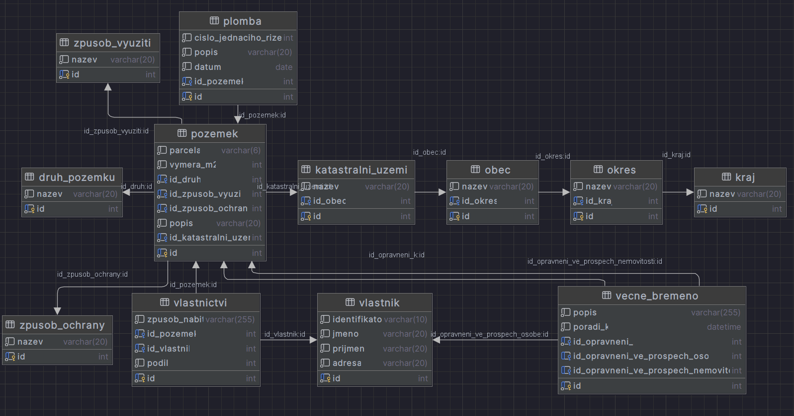

### Vzor 

## Databáze
###### specifikace
- 12 tabulek
- 3 procedury
- 1 transakce
##### ER diagram

###### export

## Aplikace

### Konfigurace
Ve složce appdata najdete konfigurační soubor config.txt který má 4 možnosti.
- server - ip adresa serveru (localhost)
- database - název databáze (alpha3)
- port - port databázového serveru (3306)
- username - název uživatelského účtu v mysql (root)
- password - heslo uživatele (student)

C:\\Users\\{currentuser}\\AppData\\Roaming\\alpha3

### Knihovny
- .NET
- .NET MAUI Blazor
- ASP .NET
###### Nuget package
- MySqlConnector
- Newtonsoft.Json
### Instalace
- Spuštěním installeru ve složce install (.msix)
- Importování struktury a dat do databáze pomocí souboru export.sql ve složce\\Dokumentace\\src
- pokud se import nezdaří použijte  postupně importujte strukturu a data.
### Architektonické návrhové vzory - Best Practice
- Aplikace je vytvořena podle MVC a je dělena do těchto částí
- složka Data (model) - obsahuje Databázové objekty, CRUD, MysqlConnector Všechny databázové objekty jsou děděni od třídy DBObjekt.
- Pages (View) - obsahuje stránky pro zobrazení modelových dat Ty jsou v DBOViews. Dále obsahuje komponenty pro výpis a import dat ve složce Components.
- Shared DBOService (controler) - service je inicializován na začátku Programu a je používán jako most mezi Stránkami a Datami

### Chyby

- Výpis Chyb je řešen pomocí elementu <h1/> ve kterém je vypsaná chybová hláška
- Nedostatkem Error výpisu je hlavně to že je třeba přejít na jinou stránku aby se hláška zobrazila.
- ERROR 1 Failed to read configuration file. - Nastala chyba v konfiguračním souboru uživatel by měl zkontrolovat zda má aplikace právo na čtení a zda li soubor je Readable nebo není editovaný jinou aplikací.
- ERROR 2 Invalid configuration format/ - Nastala chyba v dekódování configuračního souboru uživatel by měl zkontrolovat formát souboru.
- ERROR 3 Failed to open database connection. - Nastala chyba v připojování databáze uživatel by měl zkontrolovat stav databáze a uživatelské údaje v konfiguračním souboru.
- ERROR 4 Failed to execute database command. - Nastala chyba ve vykonání SQL příkazu. Zkontrolujte vztupní data.
- ERROR 5 Failed deserializing JSON - Nastala chyba při deserializaci JSON souboru zkontrolujte formát.
### Testovací scénáře
- projekt obsahuje testovací scénáře.
- 
- 
- 
- 
### Závěrečné Resume
#### Cíl 
-Vytvořit databázovou aplikaci a databázi pro evidování pozemků v katastru nemovitostí. 
#### Problémy
- Import dat je nefunkční.
- Databáze není plně normalizovaná a chybí v ní mnoho integritních omezení.
- Všechny chyby nejsou řádně řešeny a nejsou komunikovány s uživatelem.
